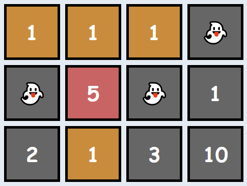

Link: https://app.codesignal.com/arcade/intro/level-2/xskq4ZxLyqQMCLshr

Given matrix, a rectangular matrix of integers, where each value represents the cost of the room, your task is to return the total sum of all rooms that are suitable for the CodeBots (ie: add up all the values that don't appear below a 0).

Example

    For

    matrix = [[0, 1, 1, 2],
              [0, 5, 0, 0],
              [2, 0, 3, 3]]

    the output should be
    matrixElementsSum(matrix) = 9.

    

    There are several haunted rooms, so we'll disregard them as well as any rooms beneath them. Thus, the answer is 1 + 5 + 1 + 2 = 9.

    For

    matrix = [[1, 1, 1, 0],
              [0, 5, 0, 1],
              [2, 1, 3, 10]]

    the output should be
    matrixElementsSum(matrix) = 9.

    

    Note that the free room in the final column makes the full column unsuitable for bots (not just the room directly beneath it). Thus, the answer is 1 + 1 + 1 + 5 + 1 = 9.

Input/Output

    [execution time limit] 4 seconds (js)

    [input] array.array.integer matrix

    A 2-dimensional array of integers representing the cost of each room in the building. A value of 0 indicates that the room is haunted.

    Guaranteed constraints:
    1 ≤ matrix.length ≤ 5,
    1 ≤ matrix[i].length ≤ 5,
    0 ≤ matrix[i][j] ≤ 10.

    [output] integer
        The total price of all the rooms that are suitable for the CodeBots to live in.
